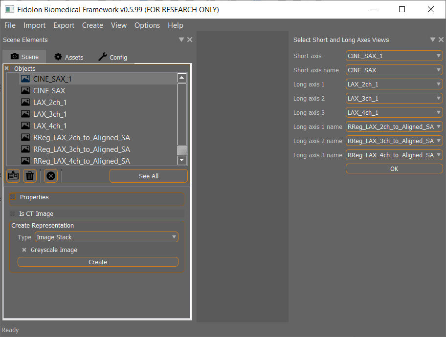
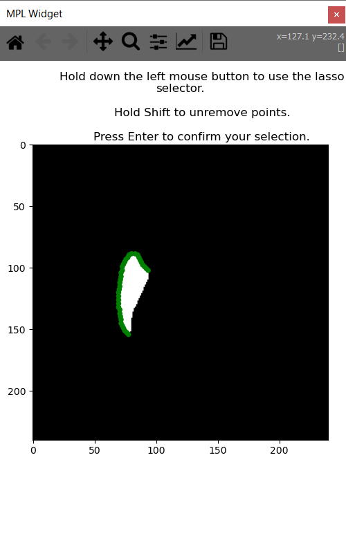
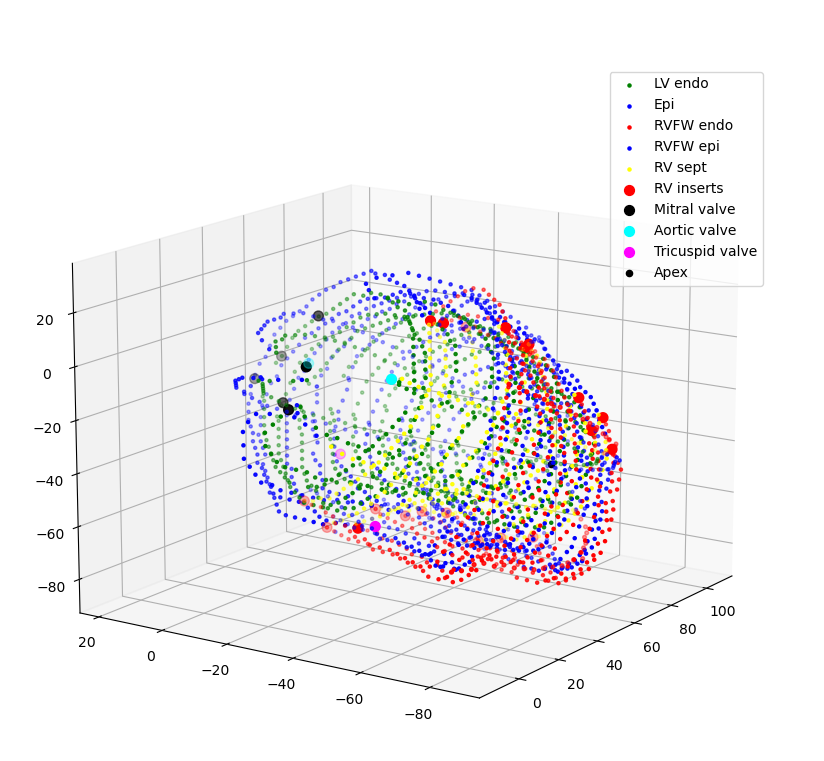
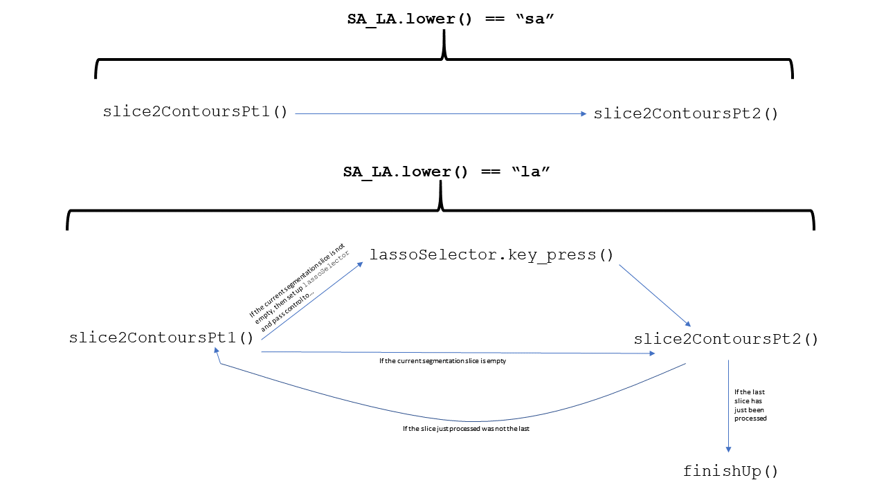

# masks2Contours

## Summary

This is a Python port of MATLAB code for a joint University of Michigan and King's College London research group. The MATLAB code took 3D selections as input (typically, we are interested in selecting the 3D geometry of a human heart) and produced contour points of those selections as output. The output contour points are labeled according to which chamber in the heart they reside in. 

"3D selections" are more commonly called "3D masks"- that is why this program is called `masks2Contours`.

The Python port improves upon the organization of the MATLAB code, and is integrated within the GUI [Eidolon](https://github.com/ericspod/Eidolon), a program written by Dr. Eric Kerfoot of King's College London. Dr. Renee Miller, also from King's College, wrote the MATLAB code, and I am the author of this Python port.

This is the Eidolon interface the user uses to select the NIFTI files that should be the input to the masks2Contours program.



After the user starts masks2Contours (`File` -> `Open Script`), they use this interface to remove undesired points from nonempty slices in the long axis segmentation:



In the above, the user clicks and drags to lasso select points. Here's the full 3D output for some sample data.



The script also outputs two files, `GPFile_py.txt` and `Case1_FR{}_py.txt`, to the folder that the NIFTI files are located in.

## How to run the script

1. Install [Eidolon](https://github.com/ericspod/Eidolon).
2. Download this project, and then place the `masks2ContoursScripts` subdirectory from this project inside the `Eidolon` folder.
3. Start Eidolon, and drag the NIFTI files that the script is to operate on into the Eidolon window. Note, you can drag multiple NIFTI files at once. Also note that the all NIFTI files come from the same folder.*
5. Click `File` -> `Open Script`, navigate to inside `masks2ContoursScripts`, and click on `masks2ContoursEidolonScript.py`.
6. Select the correct NIFTI file in each dropdown menu. Then click `OK`.

* That is, the folder containing the NIFTI files that are loaded into the dropdown menus with the "segmentation" parenthetical must be the same folder that contains the NIFTI files that are loaded into the dropdown menus with the "header metadata" parenthetical.

## Differences between this Python port and the MATLAB original 

In the MATLAB original, the function `masks2contoursSA_manual()` converted masks to contours for the short axis (SA) images, and the function `masks2contoursLA_manual()` converted masks to contours for the long axis (LA) images. These functions are replaced by `masks2ContoursSA()` and `masks2ContoursLA()` in the Python port.

### The Python port abstracts the process of converting a segmentation *slice* to contours

The Python port is more abstracted than the MATLAB original. In the MATLAB code, though `masks2contoursSA_manual()` and `masks2contoursLA_manual()` performed very similar sequences of tasks, this shared behaivor was not made obvious by a common dependency on a helper function. In the Python port, `masks2ContoursSA()` and `masks2ContoursLA()` do depend on a common helper function.

To understand precisely what `masks2ContoursSA()` and `masks2ContoursLA()` have in common, we must know that each 2D slice of the short axis 3D image has the same geometry metadata, while each long axis 2D image has different geometry metadata. Since "same geometry metadata in each slice" is a special case of "varying geometry metadata in each slice", we can use the following pseudocode for our program:

```
def masks2ContoursSA():
  geometryMetadata = getGeometryMetadataSA()
  for each short axis slice s:
    slice2Contours(geometryMetadata) # geometryMetadata is the same each iteration
    
def masks2ContoursLA():
  for each long axis slice s:
    geometryMetadata = getGeometryMetadataLA(s) 
    slice2Contours(geometryMetadata) # geometryMetadata depends on the long axis slice, s
```

Notice that in this pseudocode, `masks2ContoursSA()` and `masks2ContoursLA()` depend on the common helper function `slice2Contours()`.

#### Iterative when `SA_LA.lower() == "sa"`, recursive when `SA_LA.lower() == "la"`

Since the Eidolon GUI runs on one thread and the Python script on another, we can't return control from the lasso selector back to the function which created the lasso selector by waiting; if we want some function `f` to execute after the lasso selector is done doing its thing, we must explicitly call `f` from within one of the lasso selector's callback functions.

This means that, when processing the long axis segmentation, we have to split up the `slice2Contours()` process into a `slice2ContoursPt1()` process and a `slice2ContoursPt2()` process. For reasons explained soon, we will actually split up the `slice2Contours()` process into a `slice2ContoursPt1(SA_LA = "la")` process and a `slice2ContoursPt2(SA_LA = "la")` process. 

The `masks2ContoursLA()` function proceeds as follows:

```
def masks2ContoursLA():
  slice2ContoursPt1(SA_LA_ = "la")
  
def slice2ContoursPt1(SA_LA):
  execute some tasks
  if SA_LA == "la":
    set up a lasso selector if necessary (if not, call slice2ContoursPt2()).
    # the lasso selector responds to user input, and then calls slice2ContoursPt2()

def slice2ContoursPt2(SA_LA):
  execute some more tasks
  if SA_LA == "la":
    call slice2ContoursPt1() if the slice just processed was not the last; call finishUp() otherwise
```

Note, the `slice2Contours(SA_LA = "la")` process is recursive, since `slice2ContoursPt1(SA_LA = "la")` and `slice2ContoursPt2(SA_LA = "la")` call each other. 

Now, we explain why we have parameterzied `slice2ContoursPt1()` and `slice2ContoursPt2()` by `SA_LA`. The intention of this is to allow `slice2ContoursPt1(SA_LA = "la")` and `slice2ContoursPt2(SA_LA = "la")` to "collectively" constitue a recursive function, while having `slice2ContoursPt1(SA_LA = "sa")` and `slice2ContoursPt2(SA_LA = "sa")` collectively constitute a traditional imperative function that can be looped over, like this:

```
def masks2ContoursSA():
  for each short axis slice s:
    slice2ContoursPt1(s, SA_LA_ = "sa")
```

Here's a diagram that summarizes the dependencies between the important functions of `masks2Contours`:



(The diagram does not include the fact that `slice2Contours(SA_LA = "sa")` is used within a for loop).

You might ask, why not have a "regular" function `slice2ContoursSA()` that gets looped over, and then have two functions `slice2ContoursLAPt1()` and `slice2ContoursLAPt2()` that are "collectively recursive"? Wouldn't this be more readable?

It might be more readable in some ways. In my opinion, there are enough tasks executed each slice that are common to the short and long axes, both in "part 1" and "part 2", for this more complicated approach to be well worth it.

## A common error

If, after running `masks2ContoursEidolonScript.py` and clicking `OK`, you are met with the error `ValueError: attempt to get argmin of an empty sequence`, you likely incorrectly selected files in the dropdown menus.
